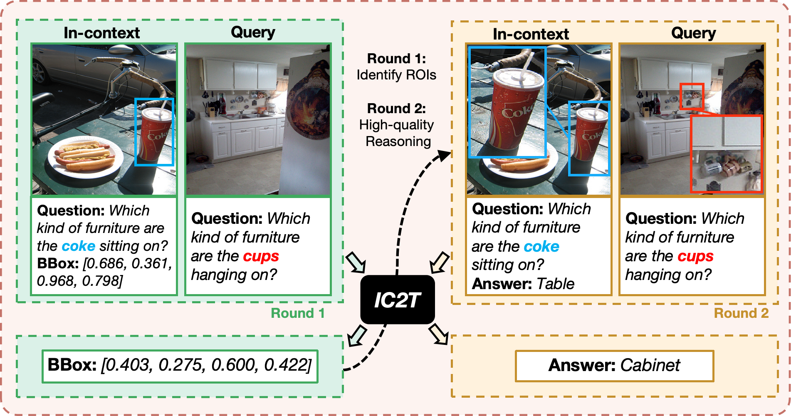
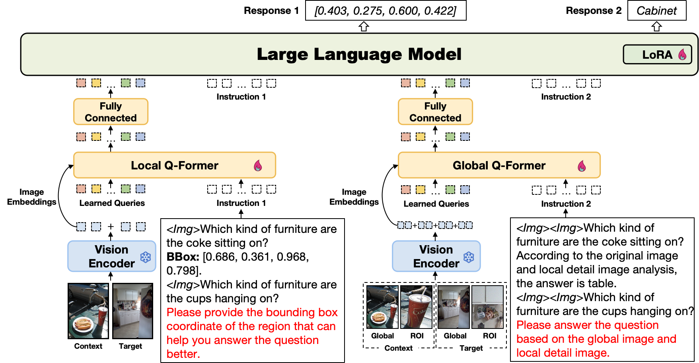

# IC2T: Embedding In-Context Learning into Chain of Thought for Vision-Language Models

## Overview
This repository contains the official implementation of the paper "**IC2T: Embedding In-Context Learning into Chain of Thought for Vision-Language Models**".

**IC2T** is a novel multimodal reasoning framework designed to progressively optimize multimodal reasoning by integrating local visual details and global contextual features through a multi-round reasoning process. The framework significantly enhances model performance in complex multimodal tasks like Visual Question Answering (VQA) and text-image alignment.

**Progressive Reasoning Process (Fig. 1):**


**Architecture of IC2T (Fig. 2):**



## Setup

### Prerequisites
- Python >= 3.10
- PyTorch
- CUDA-enabled GPU (recommended)

### Installation
```bash
conda create -n ic2t python=3.10 -y
conda activate ic2t
pip install --upgrade pip  # enable PEP 660 support
pip install -e 
```

## Dataset
Due to size constraints, only a sample of the IC2T dataset (dataset/ic2t_dataset_sample.json) is provided in this repository. The complete dataset used in the paper is too large for direct inclusion. Please refer to the sample file for dataset structure and format. For the complete dataset, please contact the authors directly. The complete dataset will be made available via an external link shortly.


### Dataset Construction
The script tinyllava/utils/process_dataset.py is designed for constructing the IC2T dataset with contextual examples. Specifically, this script: Generates textual embeddings using a pretrained DistilBERT model. Computes semantic similarity between dataset samples efficiently with FAISS.	Matches each data sample with its most semantically relevant contextual example.

To construct the contextualized dataset, execute:
```bash
python tinyllava/utils/process_dataset.py
```
By default, the script processes the file viscot_363k.json and outputs contextualized files (contextual_example_output_<dataset_name>.json).
You can adjust the parameters batch_size and top_k within process_dataset.py to balance resource usage and dataset granularity.

## Finetune
After constructing the dataset following the above data format, you can finetune model TinyLLaVA-Phi-2-SigLIP-3.1B checkpoint by using lora.
Replace data paths and output_dir with yours in scripts/train/custom_finetune_ic2t.sh
Adjust your GPU ids (localhost) and per_device_train_batch_size in scripts/train/custom_finetune.sh.
```bash
bash scripts/train/custom_finetune_ic2t.sh
```

## Continuous Updates
🚀The **IC2T** codebase, datasets, and pretrained model weights will be continuously updated. Stay tuned for further improvements and releases!

## Acknowledgments
This implementation is based on the [TinyLLaVA_Factory](https://github.com/TinyLLaVA/TinyLLaVA_Factory). We gratefully acknowledge their contribution.
